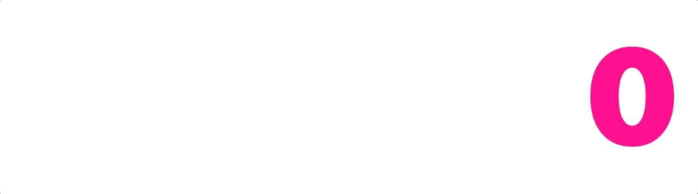

# CountLabel



Adds animated counting support to UILabel in Swift.

Based upon [CountingLabel](https://github.com/dataxpress/UICountingLabel) in Objective-C

## Setup
```swift
import BouncyLayout
```

```swift
let countLabel = CountLabel(frame: CGRect(x: 0, y: 0, width: 100, height: 44)

// configure countLabel as you would with a UILabel

self.view.addSubview(countLabel)

countLabel.count(from: 0, to: 100) {
    print("All counted out!")
}
```

## Formatting the numbers
You can assign a `NumberFormatter` to format the way the numbers are shown:
```swift
let numberFormatter = NumberFormatter()
numberFormatter.numberStyle = .none
numberFormatter.usesGroupingSeparator = true
numberFormatter.groupingSeparator = " "
numberFormatter.groupingSize = 3
numberFormatter.negativeSuffix = " kr"
numberFormatter.positiveSuffix = " kr"

countLabel.numberFormatter = numberFormatter
```

## Installation

### Carthage

CountLabel is available through [Carthage](https://github.com/Carthage/Carthage). To install
it, simply add the following line to your Cartfile:

```
github "bakkenbaeck/CountLabel"
```

## Suggestions or feedback?

Feel free to create a pull request, open an issue or find us [on Twitter](https://twitter.com/bakkenbaeck).
