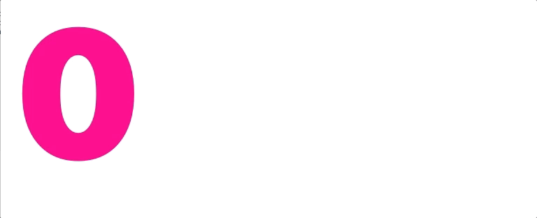

# CountLabel



Adds animated counting support to UILabel in Swift.

Based upon the [COunterLabel](https://github.com/dataxpress/UICountingLabel) in Objective-C

```
let countLabel = CountLabel(frame: CGRect(x: 0, y: 0, width: 100, height: 44)

// configure countLabel as you would with a UILabel

self.view.addSubview(countLabel)

countLabel.count(from: 0, to: 100) {
    print("All counted out!")
}
```

You can assign a `NumberFormatter` to format the way the numbers are shown:
```
let numberFormatter = NumberFormatter()
numberFormatter.numberStyle = .none
numberFormatter.usesGroupingSeparator = true
numberFormatter.groupingSeparator = " "
numberFormatter.groupingSize = 3
numberFormatter.negativeSuffix = " kr"
numberFormatter.positiveSuffix = " kr"

countLabel.numberFormatter = numberFormatter
```

